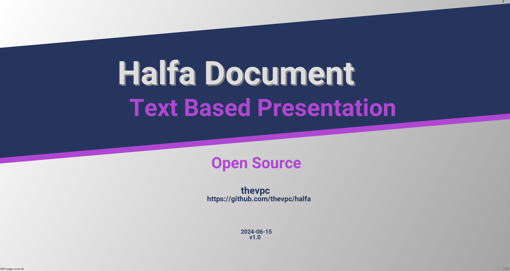

# HALFA
## DISCLAIMER :
HALFA is a codename, It's not intended to be the final project name, so bear with me until we get there...

What halfa is ? Halfa (Stripa Tenacissima plant or esparto grass) is a strong, flexible, fibrous grass that 
only grows in Tunisia, Morocco, Algeria, Spain and Portugal. 
For centuries, it's been used to produce ropes, sandals, baskets, hats, mats and fine paper. 
The weed grows up to three feet high on rocky soil in high plains.



Download documentation here : [halfa-doc.pdf](documentation/website/halfa-doc.pdf)

## What it does
halfa is a versatile presentation tool intended to replace :
- powerpoint (and its clones)
- asciidoctor (and its clones)
- latex

## How is that ?
It helps writing very powerful documentation while being just a text based.
It has a very simple yet very strong syntax
```tson
        "This is a simple text followed by 3 bullets"
        ul{
            "The first bullet is here"
            "The second bullet is there"
            "
              And the third bullet
              spreads across multiple lines
            "
        }
```

## Portable
It's fully written in Java and hence is really portable across systems and architectures.

## Multiple Renderers
We have implemented multiple renderers so that the presentation can be rendered as
- on screen presentation
- pdf file
- html file
- web served

## SCM friendly
You can create a separate file for each slide, making it easy to track them individually since they are plain text files.
When you render a folder, all its files and subfolders are processed recursively.
This provides a simpler and more structured way to organize your documentation.
Files are ordered naturally by name.

## Where to start
Run halfa-viewer (located under app) and open the GITHUB_ROOT/documentation/halfa-doc folder.
This will render a presentation of the Halfa documentation, written in Halfa and displayed as slides.

You can play with files under halfa-doc to understand how this tool works

## Best practices
### add Idea Syntax Highlighting
If you are using IntelliJ Idea, you would find it interesting to consider syntax highlighting of hd files.
You need to copy `GIHUB_ROOT/documentation/integration/Halfa.xml` under your home folder
`~/.config/JetBrains/IntelliJIdea2024.1/filetypes/`
(assuming you have IntelliJIdea2024.1 version installed, otherwise you need to consider to correct folder name)
