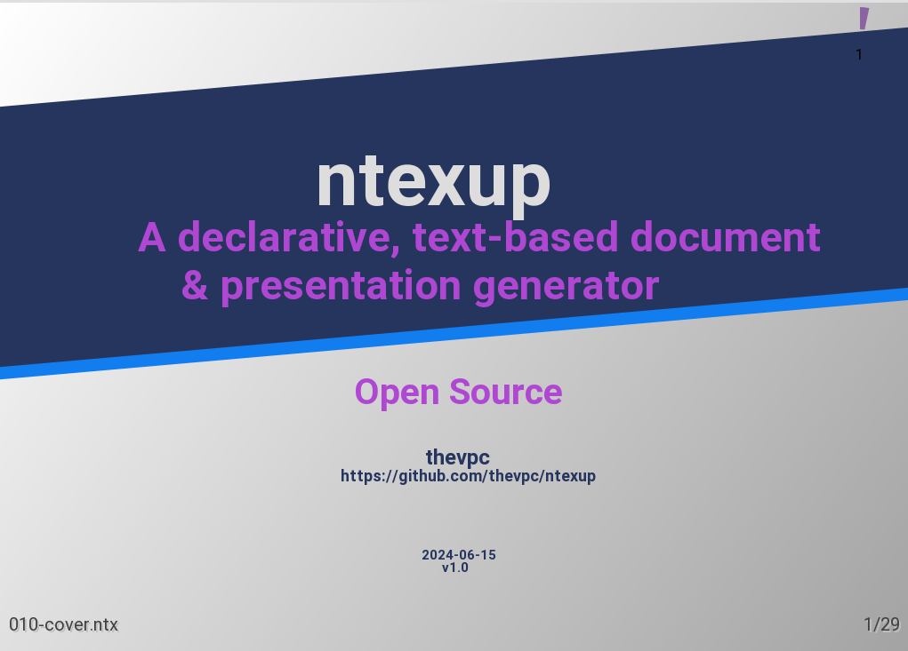
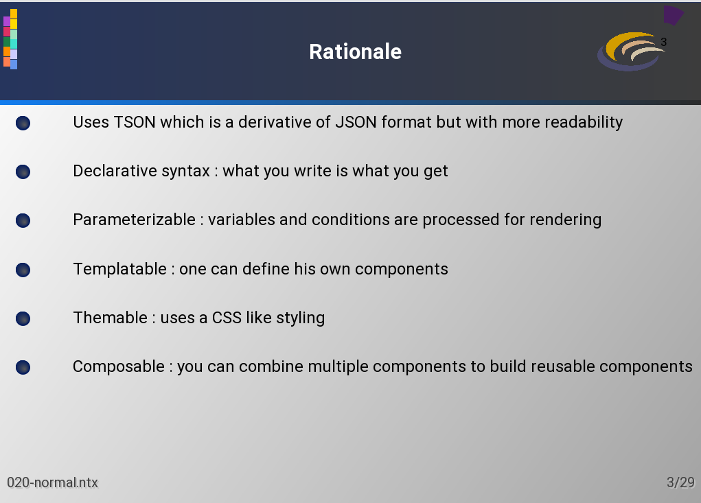

# NDOC




Download documentation here : [ndoc-doc.pdf](documentation/website/ndoc-doc.pdf)




# NDoc – Declarative Document & Presentation Generator

&#x20;&#x20;

**NDoc** is an open-source, text-based document and presentation generator designed to make the creation of professional, math-heavy, and reusable teaching materials effortless.

It is built on **Java**, **Nuts**, and **TSON**, combining the simplicity of Markdown with the power of LaTeX and the flexibility of template-driven document generation — all while being version-control friendly.

---

## **Why NDoc?**

As a teacher and researcher, I struggled with existing tools:

- **PowerPoint** is too manual and slow, especially for writing math equations or customizing figures.
- **LaTeX** is powerful but overkill for simple slides, with complex setups and dependency issues.
- **Asciidoctor** comes close but suffers from Ruby environment problems, limited equation rendering, lack of built-in figure mechanisms, and no native support for animations.

**NDoc** solves these issues by providing a **declarative, text-based** solution that is:

- Easy to write and maintain.
- **Math- and diagram-friendly** (built-in LaTeX-style math, UML, Gantt, network diagrams).
- **Composable and reusable** (templates, components, modular content).
- Fully **Git-friendly**.

---

## **Features**

- **TSON-based syntax** (Typesafe Object Notation): more readable and powerful than JSON/YAML.
- **Text-based, declarative approach**: focus on content, not layout.
- **CSS-like theming**:
  ```tson
  styles: {
      "" : { color: blue, font-size: 10 },
      title: { font-size: 50, bold: true, color: red }
  }
  ```
- **Template engine** with variables, loops, and conditions:
  ```tson
  @define course(titleComponent, title) {
      page {
          text(either($title, "Title"), at: top)
          rectangle(size: (50, 50), color: red, rotate: 45)
      }
  }
  ```
- **Multi-file support** with `include`, even from GitHub.
- **Shapes**: rectangles, circles, polygons, arrows, pies, donuts, cylinders, etc.
- **Responsive layouts**: grid, stack, relative positioning.
- **Diagrams**: UML, network diagrams, Gantt charts, wireframes.
- **Multiple text formats**:
    - LaTeX-style math equations.
    - Markdown.
    - NTF for syntax highlighting.
- **Images**: PNG, JPEG, SVG, GIF (animated).
- **Source code syntax highlighting**.
- **PDF and Swing-based on-screen rendering**.
- **Version-control friendly**.
- **Extensible via Java**, with automatic library resolution through **Nuts**.

*(Animations are planned but not yet implemented.)*

---

## **Why TSON?**

TSON is a **superset of JSON** that is more readable and flexible than YAML or XML. It powers NDoc's documents with:

- **Variables** and **expressions**.
- **Loops and conditions**.
- **Reusable components**.

Example:

```tson
for(i: [1 -> 2]) {
    course(title: "My Title Page $i") {
        equation("x = \\frac{-b \\pm \\sqrt {b^2-4ac}}{2a}", at: (50, 50))
    }
}
```

---

## **Use Cases**

- **Teaching materials and lectures**: create modular slides where chapters can be reused across courses.
- **Scientific presentations**: easily integrate math equations and diagrams.
- **Technical documentation**: generate PDFs or web-ready slides.
- **Version-controlled content**: ideal for Git workflows.

---

## **Technology Stack**

- **Language**: Java 8+ (supports java 24).
- **Package manager**: [Nuts](https://github.com/thevpc/nuts).
- **Document syntax**: TSON.
- **Rendering**: Swing viewer, PDF generator, and web-based image rendering.

---

## **Installation**

### **Prerequisites**

- Java 8 or later (supports java 24).
- [Nuts](https://github.com/thevpc/nuts) installed.

### **Setup**

```bash
nuts install ndoc
```

Or clone the repository:

```bash
git clone https://github.com/thevpc/ndoc.git
cd ndoc
mvn package
```

---

## **Usage Example**

Create a file `slides.tson`:

```tson
styles: {
    title: { font-size: 48, bold: true, color: red }
}

page {
    text("Welcome to NDoc!", style: title, at: top)
    ¶ This is a equqtion
    equation("x = \\frac{-b \\pm \\sqrt {b^2-4ac}}{2a}", at: (50, 50))
}
```

Render it:

```bash
ndoc-viewer --open slides.ndoc
```

## Where to start
Run ndoc-viewer (located under app) and open the GITHUB_ROOT/documentation/ndoc-doc folder.
This will render a presentation of the ndoc documentation, written in ndoc and displayed as slides.

You can play with files under ndoc-doc to understand how this tool works


---

## **Repository**

- **License**: [GPLv3](LICENSE).
- **Source**: [https://github.com/thevpc/ndoc](https://github.com/thevpc/ndoc).
- **Status**: Usable, actively used for teaching, still evolving.

---

## **Roadmap**

- TODO

---

## **Contributing**

Contributions are welcome! Feel free to:

- Submit issues.
- Propose features.
- Create pull requests.

---

## **Author**

Developed and maintained by [thevpc](https://github.com/thevpc).

## Best practices
### add Idea Syntax Highlighting
If you are using IntelliJ Idea, you would find it interesting to consider syntax highlighting of hd files.
You need to copy `GIHUB_ROOT/documentation/integration/ndoc.xml` under your home folder
`~/.config/JetBrains/IntelliJIdea2024.1/filetypes/`
(assuming you have IntelliJIdea2024.1 version installed, otherwise you need to consider to correct folder name)
