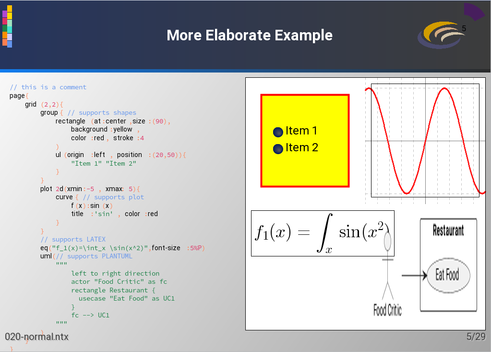

# NDOC


Download documentation here : [ndoc-doc.pdf](documentation/website/ndoc-doc.pdf)





## What it does
ndoc is a versatile presentation tool intended to replace :
- powerpoint (and its clones)
- asciidoctor (and its clones)
- latex

## How is that ?
It helps writing very powerful documentation while being just a text based.
It has a very simple yet very strong syntax
```tson
        ¶ This is a simple text followed by 3 bullets
        ul{
            ¶ The first bullet is here, the ¶ means it is a line only text/paragraph
            "The second bullet is there using double quotes"
            "
              And the third bullet
              spreads across multiple lines
            "
        }
```

## Portable
It's fully written in Java and hence is really portable across systems and architectures.

## Multiple Renderers
`ndoc`  supports multiple renderer implementations so that the presentation can be rendered as
- on screen presentation (with animations)
- pdf file
- html file / web served

## SCM friendly
You can create a separate file for each slide, making it easy to track them individually since they are plain text files.
When you render a folder, all its files and subfolders are processed recursively.
This provides a simpler and more structured way to organize your documentation.
Files are ordered naturally by name.

## Where to start
Run ndoc (located under app) and open the GITHUB_ROOT/documentation/ndoc-doc folder.
This will render a presentation of the ndoc documentation, written in ndoc and displayed as slides.

You can play with files under ndoc-doc to understand how this tool works

## Best practices
### add Idea Syntax Highlighting
If you are using IntelliJ Idea, you would find it interesting to consider syntax highlighting of hd files.
You need to copy `GIHUB_ROOT/documentation/integration/ndoc.xml` under your home folder
`~/.config/JetBrains/IntelliJIdea2024.1/filetypes/`
(assuming you have IntelliJIdea2024.1 version installed, otherwise you need to consider to correct folder name)
